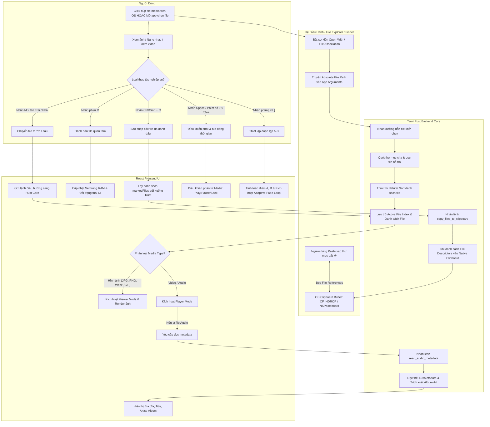

# Business Process Specification: Media Tool (`_spec1_business_process`)

> **Phiên bản:** 1.0.0  
> **Ngày cập nhật:** 2026-10-01  
> **Phân loại đặc tả:** Quy trình Nghiệp vụ, Swimlane & Ma trận Quyết định  
> **Tài liệu tham chiếu:** [00_system_overview.md](00_system_overview.md)  

---

## 1. Sơ đồ Quy trình Nghiệp vụ Swimlane (Macro Workflow)

Biểu đồ mô tả sự tương tác đa tầng giữa **Người dùng**, **Hệ điều hành (Windows Explorer / macOS Finder)**, **Tauri Core (Rust Backend)**, **Frontend Giao diện (React/TS)** và **Tầng Native OS Clipboard / Media Engine**:



---

## 2. Ba Quy trình Nghiệp vụ Trọng tâm

### Quy trình 1: Khởi động Ứng dụng & Điều phối Media (Open & Routing Process)
Mục tiêu: Đảm bảo việc mở bất kỳ file nào từ màn hình nền hệ điều hành đều đưa người dùng vào trạng thái xem/nghe ngay lập tức với danh sách lân cận đã được lập chỉ mục sẵn sàng.

```text
Click đúp file media từ File Manager (Finder / Explorer)
    │
    ▼
Hệ điều hành kích hoạt binary Media Tool và truyền argv[1]
    │
    ▼
Tauri Host bắt sự kiện file-open / single-instance
    │
    ▼
Rust Core kiểm tra file:
    ├─ Xác thực file tồn tại và có quyền đọc
    ├─ Lấy thư mục cha (parent directory)
    ├─ Quét toàn bộ file cùng cấp trong thư mục
    ├─ Lọc bỏ các định dạng không hỗ trợ và file ẩn hệ thống
    └─ Áp dụng thuật toán Natural Sort để định hình thứ tự duyệt chuẩn
    │
    ▼
Xác định vị trí hiện tại: currentIndex = index_of(activeFile)
    │
    ▼
Truyền gói dữ liệu khởi tạo lên Frontend UI qua Tauri Event / IPC
    │
    ▼
Frontend Router định tuyến:
    ├─ Nếu là Ảnh → Mở Viewer Module (tắt audio/video pipeline)
    └─ Nếu là Video/Audio → Mở Player Module (khởi tạo media engine)
```

---

### Quy trình 2: Duyệt ảnh, Đánh dấu Nhanh & Xuất File ra OS Clipboard (Viewer Flow)
Mục tiêu: Cho phép người dùng duyệt hàng trăm bức ảnh, nhấn phím chọn lọc và dán hàng loạt file vào thư mục làm việc bên ngoài OS một cách tức thì.

```text
Người dùng nhấn [Mũi tên Trái / Phải]
    │
    ▼
Frontend cập nhật ảnh hiện tại (tận dụng preloading ảnh kế tiếp)
    │
    ▼
Người dùng thấy ảnh ưng ý → Nhấn phím [M]
    │
    ▼
Frontend kiểm tra path:
    ├─ Nếu chưa có trong markedFiles → Thêm vào Set<FilePath>
    └─ Nếu đã có trong markedFiles → Xóa khỏi Set<FilePath>
    │
    ▼
UI hiển thị huy hiệu [MARKED] và cập nhật Counter tổng số ảnh đã mark
    │
    ▼
Người dùng duyệt xong bộ ảnh → Nhấn [Ctrl+C] (Win) hoặc [Cmd+C] (Mac)
    │
    ▼
Frontend trích xuất toàn bộ mảng FilePath từ Set và gọi IPC Command:
    copy_files_to_clipboard(markedFiles)
    │
    ▼
Rust Platform Adapter tương tác trực tiếp với API của Hệ điều hành:
    ├─ Windows: Tạo cấu trúc DROPFILES, ghi clipboard format CF_HDROP
    └─ macOS: Ghi vào NSPasteboard dưới dạng NSFilenamesPboardType / NSURL
    │
    ▼
Frontend nhận kết quả thành công → Bắn Toast thông báo "Đã sao chép N tệp"
    │
    ▼
Người dùng mở bất kỳ cửa sổ Explorer / Finder / Photoshop → Nhấn Paste (Ctrl/Cmd+V)
    │
    ▼
Hệ điều hành thực hiện copy/import trực tiếp các tệp thực tế
```

---

### Quy trình 3: Điều khiển Phát Media, Vòng lặp A–B & Adaptive Audio Fade (Player Flow)
Mục tiêu: Phục vụ trải nghiệm học tập, bóc băng, nghe nhạc, soi chi tiết chuyển động video thông qua vòng lặp không độ trễ và không bị giật âm thanh.

```text
Người dùng mở video hoặc bài hát
    │
    ▼
Frontend nạp nguồn phát và hiển thị thời lượng (duration)
    │
    ▼
Người dùng thao tác phím tắt:
    ├─ Space: Chuyển đổi trạng thái Play ↔ Pause
    ├─ Phím 0 đến 9: Nhảy tức thì đến (Phím × 10)% của video/audio
    ├─ Mũi tên Trái/Phải: Nhảy ±1 giây (tự động clamp trong khoảng [0, duration])
    ├─ Shift + Mũi tên Trái/Phải: Nhảy ±5 giây
    └─ Ctrl/Cmd + Mũi tên: Chuyển sang bài/video kế tiếp trong thư mục
    │
    ▼
Thiết lập đoạn lặp A–B:
    ├─ Tại mốc đầu mong muốn: Nhấn phím '[' → Ghi nhận pointA = currentTime
    └─ Tại mốc cuối mong muốn: Nhấn phím ']' → Ghi nhận pointB = currentTime
    │
    ▼
Hệ thống kiểm tra điều kiện hợp lệ: A < B
    │
    ▼
Bật chế độ lặp (A-B Loop Enabled):
    │
    ▼
Trong lúc phát, đồng hồ playback tiệm cận pointB:
    │
    ▼
Tính toán thời lượng fade:
    loopDuration = pointB - pointA
    Nếu loopDuration < 0.5s: fadeDuration = 0
    Nếu loopDuration ≥ 0.5s: fadeDuration = min(loopDuration × 0.02, 0.1s)
    │
    ▼
Thực thi chuyển đoạn (Audio Loop Transition):
    ├─ Cách pointB đúng thời gian fadeDuration: Hạ dần âm lượng (Fade-out về 0)
    ├─ Ngay khi chạm pointB: Tua tức thì (Seek) về pointA
    ├─ Bắt đầu phát từ pointA: Nâng dần âm lượng từ 0 lên mức gốc (Fade-in)
    └─ Tiếp tục vòng lặp chu kỳ kế tiếp mượt mà
```

---

## 3. Ma trận Quyết định Điều phối Media (Media Routing Decision Matrix)

Khi một tệp tin được kích hoạt, hệ thống căn cứ vào phần mở rộng (File Extension) và MIME type để điều phối hiển thị:

| Nhóm Định dạng | Các phần mở rộng (Extensions) | Phân hệ Xử lý | Các tính năng được kích hoạt |
| :--- | :--- | :--- | :--- |
| **Ảnh tĩnh / Động** | `.jpg`, `.jpeg`, `.png`, `.webp`, `.gif`, `.avif` | **Viewer Module** | View Fit/Full, Next/Prev, Mark (`M`), Copy Marked (`Ctrl/Cmd+C`). Tắt toàn bộ engine video/audio. |
| **Video** | `.mp4`, `.mov`, `.webm`, `.mkv` | **Player Module** *(Video View)* | Khung hiển thị Video Canvas, Play/Pause (`Space`), Seek tỉ lệ (`0-9`), Seek giây, A–B Loop, Mark (`M`). Ẩn khung Artwork. |
| **Âm thanh** | `.mp3`, `.wav`, `.flac`, `.m4a` | **Player Module** *(Audio View)* | Khung hiển thị Album Artwork + Thẻ Metadata (Title, Artist, Album), Timeline Seek, A–B Loop, Adaptive Fade, Mark (`M`). |
| **File không hỗ trợ / File rác** | `.txt`, `.pdf`, `.exe`, `.DS_Store`, `Thumbs.db`... | **Bỏ qua (Ignored)** | Tự động loại khỏi danh sách file lân cận khi quét thư mục; nếu người dùng cố tình mở file này, hiển thị màn hình cảnh báo không hỗ trợ và giữ app không bị crash. |

---

## 4. Sơ đồ SIPOC (Suppliers - Inputs - Processes - Outputs - Customers)

| Thành phần | Đặc tả chi tiết cho Media Tool V1 |
| :--- | :--- |
| **Suppliers (Nguồn cung)** | Hệ điều hành (Windows 11 / macOS), Hệ thống tệp cục bộ (Local Hard Drive / SSD / External USB), Thao tác bàn phím người dùng. |
| **Inputs (Dữ liệu đầu vào)** | Đường dẫn tệp media (`file_path`), Sự kiện gõ phím (`keydown`), Thao tác chuột, Trạng thái hệ thống clipboard. |
| **Processes (Quy trình lõi)** | 1. Quét & Sắp xếp tự nhiên thư mục cha.<br>2. Trình diễn ảnh siêu tốc & quản lý tập hợp `markedFiles`.<br>3. Điều phối playback media & xử lý vòng lặp A-B kèm hạ/tăng âm thích ứng.<br>4. Đẩy danh sách file references vào OS clipboard. |
| **Outputs (Kết quả đầu ra)** | Giao diện hiển thị media sắc nét, Âm thanh phát mượt mà, Bộ đệm Clipboard hệ thống chứa tham chiếu tệp thật sẵn sàng để dán. |
| **Customers (Người thụ hưởng)** | Product Owner (Người dùng cá nhân duy nhất), Các ứng dụng khác trong OS tiếp nhận paste tệp (Finder, Explorer, Telegram, Photoshop...). |

---

## 5. Quy tắc Nghiệp vụ An toàn & Ứng phó Lỗi (Business Resilience Rules)

1. **Nguyên tắc Không phá hủy (Non-Destructive Guarantee):** 
   - Tuyệt đối **không bao giờ** ghi đè, sửa đổi, nén hoặc xóa các tệp tin media gốc của người dùng trong mọi tình huống.
   - Tính năng Adaptive Fade thuần túy là can thiệp âm lượng đầu ra của trình phát (Volume Ramp), không xuất hay chỉnh sửa tệp âm thanh.
2. **Nguyên tắc Cô lập Phiên (Session Isolation):**
   - Trạng thái đánh dấu (`markedFiles`) chỉ tồn tại trong bộ nhớ RAM của phiên làm việc.
   - Khi đóng ứng dụng, toàn bộ danh sách mark tự động giải phóng, không lưu file tạm rác vào ổ đĩa.
3. **Nguyên tắc Không gián đoạn (Graceful Continuity):**
   - Khi một file trong danh sách bị lỗi giải mã (corrupted), hệ thống hiển thị thông báo lỗi cục bộ trên màn hình và cho phép người dùng bấm Mũi tên chuyển sang file kế tiếp bình thường mà không bị crash văng app.
