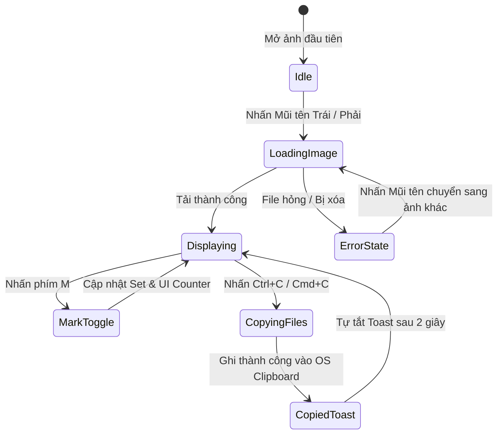
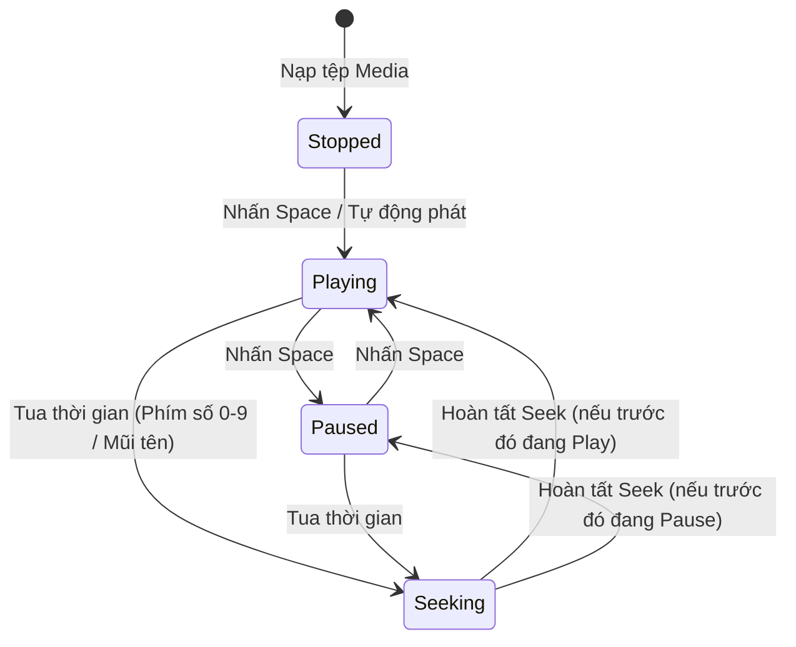
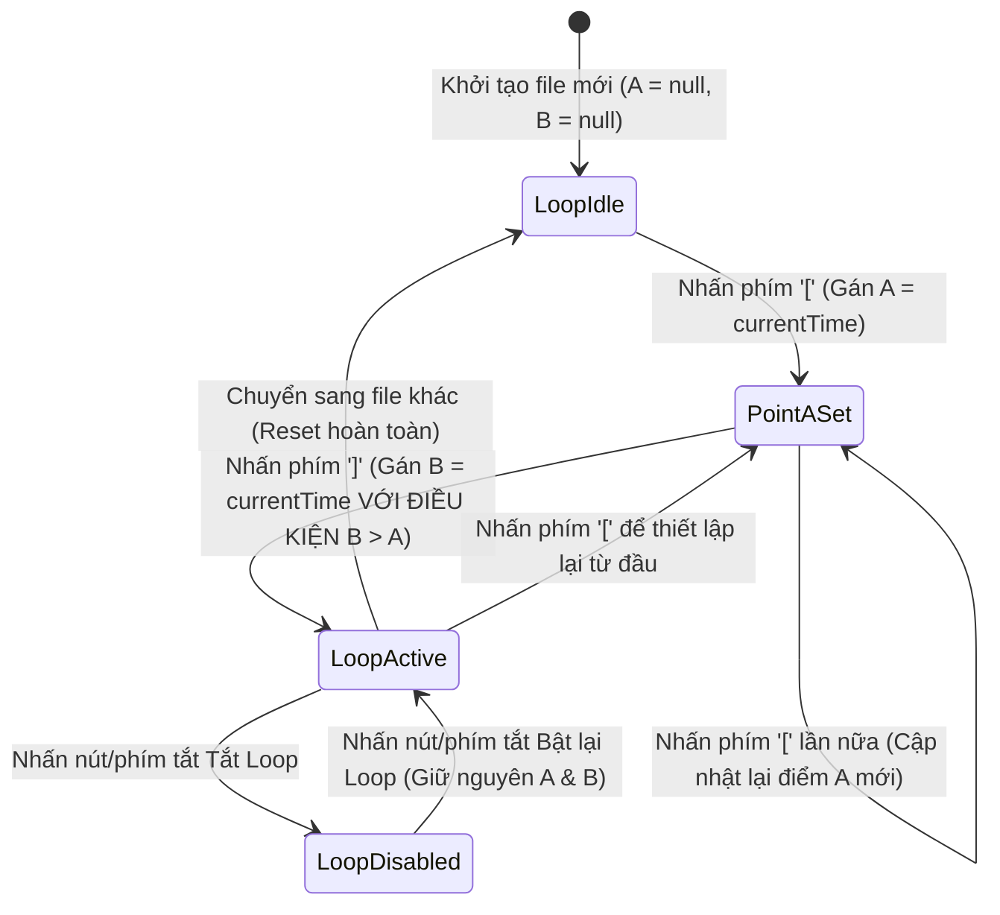

# Feature Flow & Logic Specification: Media Tool (`_spec2_feature_flow`)

> **Phiên bản:** 1.0.0  
> **Ngày cập nhật:** 2026-10-01  
> **Phân loại đặc tả:** Luồng Tính năng, Thuật toán, Máy trạng thái (State Machine) & Xử lý biên  
> **Tài liệu tham chiếu:** [00_system_overview.md](00_system_overview.md), [01_business_process.md](01_business_process.md)  

---

## 1. Thuật toán Sắp xếp Tự nhiên (Natural Sort Algorithm)

Khi mở một tệp bất kỳ trong thư mục, hệ thống quét toàn bộ thư mục cha và bắt buộc phải áp dụng thuật toán **Sắp xếp tự nhiên (Natural Sort)** thay vì sắp xếp từ điển (Alphabetical/ASCII sort).

### A. Sự khác biệt cốt lõi:
- **Sắp xếp theo mã ASCII thuần (Sai quy chuẩn):**  
  `01.jpg` → `02.jpg` → `10.jpg` → `03.jpg` (Do ký tự '1' đứng trước ký tự '0'/'3').
- **Sắp xếp Tự nhiên (Natural Sort - Chuẩn mực V1):**  
  `01.jpg` → `02.jpg` → `03.jpg` → `10.jpg` → `100.jpg`.

### B. Logic triển khai thuật toán trên Rust Backend:
```rust
// Phân rã chuỗi tên file thành các phần: Khối văn bản và Khối số nguyên
fn natural_sort_key(s: &str) -> Vec<SortChunk> {
    // Tách "img12_test.png" thành [Chunk::Text("img"), Chunk::Number(12), Chunk::Text("_test.png")]
    // So sánh theo thứ tự từng chunk: Chunk::Number so sánh giá trị số nguyên u64
}
```

### C. Quy trình Xử lý Danh sách File (File Enumeration Pipeline):
1. Đọc danh sách file cùng cấp trong thư mục cha (không duyệt đệ quy).
2. Lọc bỏ file ẩn (bắt đầu bằng dấu chấm `.`), file hệ thống (`Thumbs.db`, `.DS_Store`).
3. Lọc lấy các file có đuôi nằm trong danh sách định dạng hỗ trợ (khớp với nhóm đang mở).
4. Áp dụng `natural_sort` trên tên file (chữ hoa/chữ thường không phân biệt - case-insensitive).
5. Xác định chỉ mục hiện tại: `current_index = list.find_index(opened_file_path)`.

---

## 2. Luồng Tính năng Phân hệ Viewer (Image Viewer Flows)



### Chi tiết các bước xử lý:
1. **Hiển thị Ảnh (Image Rendering):**
   - Sử dụng thẻ `` tối ưu hóa của HTML5/React hoặc Object URL bản địa.
   - Bố cục `object-fit: contain` đảm bảo ảnh luôn nằm trọn vẹn trong vùng hiển thị cửa sổ mà không bị méo tỉ lệ.
   - Nền cửa sổ sử dụng màu xám đen trung tính (`#0f1117`) để làm nổi bật độ tương phản của ảnh.
2. **Cơ chế Tải trước Nhẹ (Lightweight Preloading):**
   - Để chuyển ảnh tức thì không có màn hình đen giật cục, khi đang xem ảnh ở vị trí `i`, hệ thống tự động khởi tạo ngầm đối tượng `Image()` trong bộ nhớ cho vị trí `i - 1` và `i + 1`.
   - **Tuyệt đối không tải trước toàn bộ thư mục** để tránh tràn bộ nhớ RAM khi thư mục có hàng nghìn ảnh RAW/JPG độ phân giải lớn.
3. **Cơ chế Đánh dấu (Mark State):**
   - Quản lý bằng cấu trúc `Set<string>` (lưu đường dẫn tuyệt đối của file).
   - Khi nhấn `M`:
     - Nếu `markedSet.has(path)`: Xóa khỏi Set, trạng thái `is_marked = false`.
     - Nếu chưa: Thêm vào Set, trạng thái `is_marked = true`.
   - Cập nhật số đếm trên HUD: `Marked: ${markedSet.size}`.
4. **Cơ chế Sao chép & Di chuyển File Ra OS (Native Clipboard Copy & Cut):**
   - **Sao chép DUY NHẤT file hiện tại:** Khi nhấn `Cmd+C` (Mac) hoặc `Ctrl+C` (Win) hoặc bấm nút `[📋 Copy Ảnh này]`:
     - Ứng dụng chỉ đưa đường dẫn của file đang mở vào OS Clipboard.
     - Bắn Toast: *"✓ Đã sao chép file hiện tại vào Clipboard"*.
   - **Sao chép HÀNG LOẠT file đã đánh dấu:** Khi bấm nút `[📦 Copy Đã Mark (N)]` hoặc nhấn `Cmd/Ctrl + Shift + C`:
     - Ứng dụng lấy toàn bộ mảng file trong `markedSet` đưa vào OS Clipboard.
     - Bắn Toast: *"✓ Đã sao chép N tệp vào Clipboard"*.
   - **CẮT / DI CHUYỂN file đã đánh dấu (Cut Marked):** Khi bấm nút `[✂️ Cut Đã Mark (N)]` hoặc nhấn `Cmd/Ctrl + X`:
     - Gọi Tauri command `clipboard_files(paths, is_cut = true)`.
     - Trên Windows: Thiết lập thêm thuộc tính `Preferred DropEffect = DROPEFFECT_MOVE` vào clipboard.
     - Trên macOS: Ghi nhãn metadata di chuyển tệp vào Pasteboard.
     - Khi người dùng sang Finder / Explorer nhấn Paste, các tệp vật lý sẽ được di chuyển (Move) sang thư mục đích.
     - Bắn Toast: *"✂️ Đã cắt N tệp vào Clipboard (Sẵn sàng di chuyển)"*.

---

## 3. Luồng Duyệt Thư mục Hỗn hợp & Tự động Chuyển Đổi (Mixed Folder Flow)

Khi một thư mục chứa lẫn lộn cả Ảnh (`.jpg`, `.png`), Video (`.mp4`, `.mov`) và Âm thanh (`.mp3`):
1. **Lập chỉ mục Thống nhất (Unified File Index):** Rust Core quét và sắp xếp toàn bộ media hợp lệ theo `natural_sort`.
2. **Tự động Hoán đổi Phân hệ (Dynamic Hot-Swap):**
   - Đang ở file ảnh (`01.jpg`) → Bấm Next → Gặp file video (`02.mp4`):
     - Giao diện Viewer mờ đi, phân hệ Video Player lập tức được khởi tạo và render khung phát video.
   - Đang ở file video (`02.mp4`) → Bấm Next → Gặp file ảnh (`03.jpg`):
     - Video Player giải phóng tài nguyên phát media, giao diện Viewer lập tức hiển thị ảnh.
3. **Quy tắc Phím tắt Điều hướng:**
   - **Tại phân hệ Viewer (Ảnh):** Do không có timeline, phím `Mũi tên Trái / Phải` (`←` / `→`) hoặc `Cmd/Ctrl + ←` / `→` đều có tác dụng chuyển file trước / sau.
   - **Tại phân hệ Player (Video / Audio):** Phím `←` / `→` đảm nhiệm chức năng tua ±1s. Để chuyển sang file tiếp theo trong danh sách hỗn hợp, bắt buộc sử dụng **`Cmd + →` (macOS)** hoặc **`Ctrl + →` (Windows)**.
   - **Nút bấm trên UI:** Hai nút bấm **`[◀ File]`** và **`[File ▶]`** luôn cố định trên giao diện của cả Viewer và Player, giúp người dùng dùng chuột chuyển file liền mạch không cần nhớ phím tắt.

---

## 3. Luồng Tính năng Phân hệ Player (Audio / Video Playback)

### A. Máy Trạng thái Playback (Playback State Machine)



### B. Hợp đồng Tua Thời gian (Seek Keyboard Contract & Boundary Clamping)

Mọi thao tác tua bắt buộc phải tuân theo quy tắc chặn biên nghiêm ngặt:
$$\text{newTime} = \max(0, \min(\text{targetTime}, \text{duration}))$$

*(Quy chuẩn tính toán thay thế No-LaTeX: `newTime = clamp(targetTime, 0, duration)`)*

| Thao tác Phím | Công thức Tính toán Mục tiêu | Xử lý Biên (Clamping) |
| :--- | :--- | :--- |
| **Phím `0` đến `9`** | `target = (key_number × 0.10) × duration` | Phím `0` về đúng `0.0s`, phím `5` về đúng 50%, phím `9` về đúng 90% timeline. |
| **Mũi tên Trái (`←`)** | `target = currentTime - 1.0` | Nếu `currentTime < 1.0s` → Về đúng `0.0s` (Không sinh số âm). |
| **Mũi tên Phải (`→`)** | `target = currentTime + 1.0` | Nếu `target > duration` → Về đúng `duration` (Dừng ở cuối video). |
| **Shift + Mũi tên Trái** | `target = currentTime - 5.0` | Nhảy lùi 5 giây; chặn dưới tại `0.0s`. |
| **Shift + Mũi tên Phải** | `target = currentTime + 5.0` | Nhảy tới 5 giây; chặn trên tại `duration`. |
| **Ctrl/Cmd + Mũi tên** | Chuyển sang file trước/sau trong danh sách | Reset toàn bộ trạng thái A–B Loop và nạp file mới. |

---

## 4. Đặc tả Vòng lặp A–B Loop & Thuật toán Adaptive Audio Fade

Vòng lặp A–B cho phép người dùng lặp đi lặp lại một phân đoạn nhất định của video hoặc audio.

### A. Máy Trạng thái Vòng lặp A–B (A–B Loop State Machine)



### B. Quy tắc Hợp lệ của Điểm A và B:
1. **Điểm A:** Được xác lập khi người dùng nhấn `[`. Lúc này `pointA = currentTime`.
2. **Điểm B:** Được xác lập khi người dùng nhấn `]`.
   - Nếu `currentTime > pointA`: Thiết lập thành công `pointB = currentTime`, tự động kích hoạt vòng lặp `isLoopActive = true`.
   - Nếu `currentTime ≤ pointA`: Bỏ qua hoặc gán `pointB = min(duration, pointA + 1.0)` để đảm bảo luôn thỏa mãn điều kiện `pointA < pointB`.
3. Khi người dùng chủ động tua thời gian (`seek`) ra ngoài khoảng `[pointA, pointB]`: Tạm dừng vòng lặp hoặc tự động kéo con trỏ playback quay trở lại điểm A.

---

### C. Thuật toán Fade Âm thanh Thích ứng (Adaptive Audio Fade Algorithm)

**Mục đích:** Khi lặp lại một đoạn âm thanh ngắn liên tục, việc nhảy tức thì từ điểm B về điểm A sẽ tạo ra tiếng "bụp" (audio pop/click) rất khó chịu cho tai người nghe do biên độ sóng âm bị ngắt đột ngột. Thuật toán này hạ dần âm lượng (Fade-out) ngay trước điểm B và nâng dần âm lượng (Fade-in) ngay sau điểm A.

```text
Quy chuẩn Tính toán Thời lượng Fade:

1. Tính độ dài đoạn lặp:
   loopDuration = pointB - pointA

2. Xác định thời lượng Fade:
   Nếu loopDuration < 500 ms (0.5 giây):
       fadeDuration = 0 ms  (Đoạn quá ngắn, không can thiệp để giữ nguyên nhịp)
   Nếu loopDuration ≥ 500 ms:
       fadeDuration = min(loopDuration × 0.02, 100 ms)
       (Thời lượng fade tối đa là 100 mili-giây, hoặc bằng 2% chiều dài đoạn lặp)

Ví dụ thực tế:
- Đoạn lặp 1.0s  → fadeDuration = 20 ms
- Đoạn lặp 2.5s  → fadeDuration = 50 ms
- Đoạn lặp 5.0s+ → fadeDuration = 100 ms (Chạm ngưỡng trần tối đa)
```

### Biểu đồ Đường cong Âm lượng theo Thời gian (Volume Envelope Curve):

```text
Âm lượng (Volume)
 100% ──────┐                                     ┌──────
            │ \                                 / │
            │  \ (Fade-out)         (Fade-in)  /  │
            │   \                             /   │
   0% ──────┴────▼───────────────────────────▲────┴──────
            │◄───►│                         │◄───►│
         fadeDuration                    fadeDuration
            │                               │
        (B - fadeDuration)                  A           B
```

**Nguyên tắc Kỹ thuật & Triển khai Web Audio API GainNode:**
- **Không sửa file gốc:** Chỉ can thiệp vào tín hiệu âm thanh xuất ra loa (Playback Output), tuyệt đối không ghi đè dữ liệu tệp vật lý.
- **Không crossfade:** Đây là cơ chế Fade-out then Seek then Fade-in, không trộn hai luồng âm thanh cùng một lúc.
- **Triển khai qua Web Audio API (`GainNode`):** 
  - Thay vì thay đổi thuộc tính `media.volume` một cách thủ công (dễ bị giật theo khung hình của JS event loop), hệ thống kết nối `<audio>` / `<video>` vào một `GainNode` của `AudioContext`.
  - Sử dụng phương thức chuẩn `gainNode.gain.linearRampToValueAtTime()` hoặc `exponentialRampToValueAtTime()`.
  - **Lý do lựa chọn:** Web Audio API chạy trên luồng âm thanh chuyên dụng (Audio Rendering Thread) của hệ điều hành, cho phép điều khiển âm lượng chính xác đến từng mili-giây với độ mượt tuyệt đối, loại bỏ 100% tiếng bụp (audio clicks/pops) mà không gây tốn CPU.

---

## 5. Luồng Trích xuất & Hiển thị Metadata Âm thanh (Audio Metadata Pipeline)

Khi mở một tệp âm thanh (`.mp3`, `.flac`, `.wav`, `.m4a`), hệ thống đọc thông tin từ file theo quy trình Read-Only:

```mermaid
graph TD
    A[Mở file Audio] --> B[Gọi Rust Tauri Command: read_audio_metadata]
    B --> C{Trích xuất Metadata bằng thư viện Rust (lofty/id3)}
    
    C -- Đọc thành công --> D[Trích xuất các trường thông tin khả dụng]
    D --> D1[Title / Tiêu đề bài hát]
    D --> D2[Artist / Nghệ sĩ biểu diễn]
    D --> D3[Album / Tên album]
    D --> D4[Track Number & Year / Năm phát hành]
    D --> D5{Có nhúng Bìa đĩa (Cover Art)?}
    
    D5 -- Có --> E1[Chuyển đổi binary ảnh sang Base64 Data URL]
    D5 -- Không --> E2[Sử dụng ảnh placeholder đĩa than mặc định]
    
    C -- Không có metadata / Lỗi --> F[Sử dụng Tên file làm Tiêu đề dự phòng]
    F --> E2
    
    D1 & D2 & D3 & D4 & E1 & E2 --> G[Hiển thị lên Player Audio View]
```

### Quy tắc Dự phòng (Fallback Rules):
- Nếu trường `Title` bị rỗng: Lấy tên file (đã bỏ đuôi mở rộng) làm tiêu đề hiển thị.
- Nếu trường `Artist` bị rỗng: Hiển thị nhãn `"Unknown Artist"`.
- Nếu trường `Album` bị rỗng: Bỏ trống hoặc ẩn dòng Album.
- Nếu không có `Artwork`: Hiển thị khung tròn đồ họa đĩa than tối giản mang phong cách hiện đại.
- Thiếu bất kỳ trường metadata nào cũng **tuyệt đối không được coi là lỗi** làm gián đoạn việc phát bài hát.
